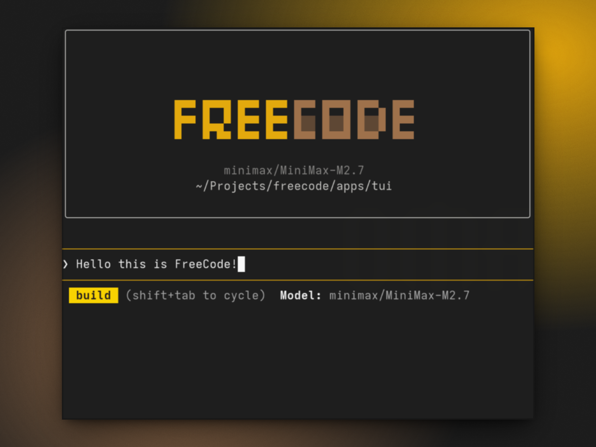
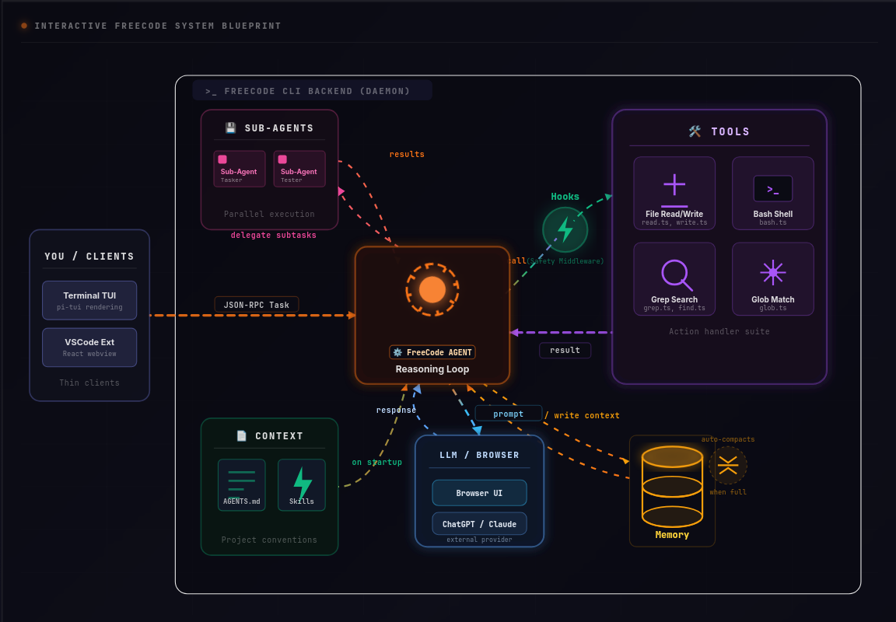

<div align="center">

<pre>
<span style="color: #F5C71A;">█▀▀ █▀▀█ █▀▀ █▀▀ </span><span style="color: #9e714b;">█▀▀ █▀▀█ █▀▀▄ █▀▀</span>
<span style="color: #F5C71A;">█▀▀ █▄▄▀ █▀▀ █▀▀ </span><span style="color: #9e714b;">█   █  █ █  █ █▀▀</span>
<span style="color: #F5C71A;">▀   ▀ ▀▀ ▀▀▀ ▀▀▀ </span><span style="color: #9e714b;">▀▀▀ ▀▀▀▀ ▀▀▀  ▀▀▀</span>
</pre>


**Open source CLI tool that drives AI coding assistants via browser automation**

[](LICENSE)




</div>

**FreeCode** is a thin-client CLI that drives AI coding assistants (ChatGPT, Claude, Gemini) via browser automation to assist with coding tasks. The architecture uses a two-phase approach: the AI first returns which files it needs, then receives those files with the prompt and returns structured file changes.

## Features

- **TUI + VS Code Extension** — Choose your interface
- **JSON-RPC over stdin/stdout** — Lightweight IPC between frontends and CLI
- **Browser-based AI providers** — Direct integration with ChatGPT, Claude, Gemini
- **Two-phase context collection** — Efficient file retrieval before prompts
- **Diff preview before apply** — Review changes before writing
- **Persistent CLI daemon** — Reuses browser connection across turns

## Supported Tools

| Tool | Description | Parameters |
|------|-------------|------------|
| `read` | Read file or directory contents | `filePath`, `offset?`, `limit?` |
| `write` | Create or overwrite files | `filePath`, `content` |
| `edit` | Edit files in-place with smart matching | `filePath`, `oldString`, `newString`, `replaceAll?` |
| `glob` | Find files matching glob patterns | `pattern`, `path?` |
| `grep` | Search file contents via regex | `pattern`, `path?`, `include?`, `-n?`, `-i?`, `-C?` |
| `bash` | Execute shell commands | `command`, `timeout?`, `workdir?` |
| `skill` | Load specialized skills from SKILL.md | `name` |
| `question` | Ask user clarifying questions | `questions` (JSON array) |

### Tool Execution Modes

| Mode | Tools | Behavior |
|------|-------|----------|
| **Sequential** | `edit`, `write` | One at a time, in order |
| **Parallel-safe** | `read`, `glob`, `grep` | Batch concurrently |

## Skills

Skills are specialized instruction sets loaded from `SKILL.md` files. They provide structured workflows for specific tasks.

**Skill locations:**
- `~/.claude/skills/` — Global skills
- `~/.agents/skills/` — Agent skills
- `.claude/skills/` — Project skills
- `.freecode/skills/` — Project skills

**Example skill structure:**
```markdown
# .freecode/skills/brainstorming/SKILL.md
---
name: brainstorming
description: Explore requirements before building features
---
# Brainstorming Skill

1. Clarify the goal - what problem are we solving?
2. Identify constraints - what must/must not happen?
3. Explore alternatives - what approaches exist?
4. Define success - how do we know it's done?
```

## Quick Start

```bash
# Install dependencies
npm install

# Start the TUI
cd apps/tui && npm run dev
```

## Architecture

```
┌─────────────────────────────────────────────────────────────┐
│                          TUI                                 │
│              (apps/tui) — pure UI shell                    │
│         Uses pi-tui for terminal rendering                  │
│         IPC client sends/receives JSON-RPC                  │
└──────────────────────────┬──────────────────────────────────┘
                           │
                           │ JSON-RPC (stdin/stdout)
                           ▼
┌─────────────────────────────────────────────────────────────┐
│                          CLI Backend                        │
│              (apps/core) — ALL intelligence                  │
│   Browser controller, parser, tools, context engine,        │
│   agent loop, file applier                                  │
└──────────────────────────┬──────────────────────────────────┘
                           │
                           ▼
┌─────────────────────────────────────────────────────────────┐
│                      AI Provider (Browser)                   │
│                    ChatGPT / Claude / Gemini                 │
└─────────────────────────────────────────────────────────────┘
```

## Documentation

- [Architecture Overview](docs/superpowers/specs/2026-05-23-architecture.md)
- [Agent Loop Design](docs/superpowers/specs/2026-05-25-agent-loop.md)
- [Implementation Plan](docs/superpowers/plans/2026-05-10-freecode-mvp.md)

## License

MIT