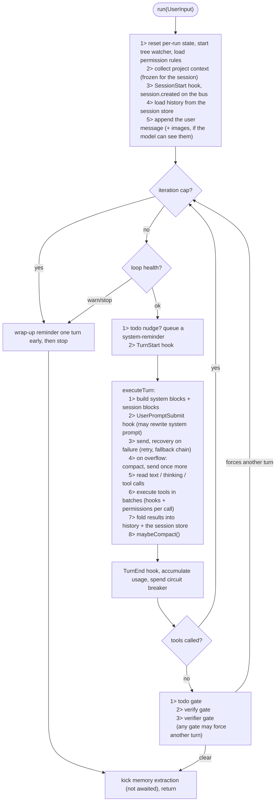
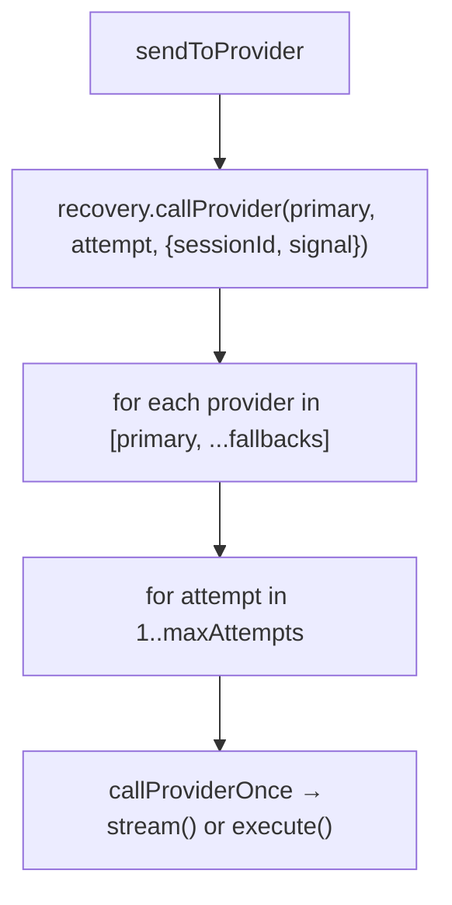
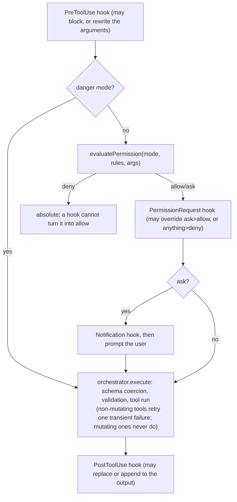

# Agent loop

A language model cannot read a file, run a test, or save an edit. It can only
read text and produce text. Everything else — the reading, the running, the
saving — is done by the program around it, and that program is the **agent
loop**.

The deal is simple and it repeats:

> Here is the project, here is the conversation so far, and here is a list of
> tools you may ask me to run. Answer, or ask for a tool.

If the model answers with plain text, the loop is done. If it asks for tools,
the loop runs them, appends the results to the conversation, and asks again.
That is the whole engine (`agent/loop.ts`). Everything else on this page is
detail about how each of those steps is made cheap, safe, and hard to get stuck
in.

## Vocabulary

Four words get used interchangeably in most write-ups about agents. Here they
mean different things, and the difference matters when reading the code.

| Term | What it is | Where it lives |
| --- | --- | --- |
| **Session** | One conversation, persisted, resumable. Survives restarts. | `session/`, `store/` |
| **Run** | One `run(UserInput)` call — everything that happens because of *one* user message. | `loop.ts:543` |
| **Turn / iteration** | One provider call plus the tools it asked for. A run has many. | `loop.ts:1281` (`executeTurn`) |
| **Batch** | A group of tool calls from one turn that may execute concurrently. | `tools/batching.ts` |

`turnCount` and `iterationCount` are both incremented in the same place and are
always equal; the loop keeps both because `SessionState` predates the merge.

A fresh `AgentLoop` is constructed for **every user message** (`server.ts:199`)
and reloads history from the session store. So "per-run state" and "per-instance
state" are the same thing on the interactive path — which is load-bearing in one
place, and a bug in another (see [Known gaps](#known-gaps)).

## The shape of one run



## Before the first request

`run()` starts by throwing away everything that belonged to the previous prompt
(`loop.ts:543`). Loop-health counters in particular are per-run: carrying them
forward would let one prompt's history stop the *next* prompt before it ever
reached the provider.

Then, in order:

1. **Watch the project** — `ensureWatching(projectPath)`, idempotent per project.
2. **Load permission rules** — project and user `.freecode/settings.json`, watched
   for changes (`permission/settings.ts`).
3. **Collect context** — name, path, file tree, git HEAD, and an hour-rounded
   clock, via `getFrozenSessionContext` (`context/session-context.ts:39`).
   Snapshotted on the session's first turn and reused verbatim afterwards.
4. **`SessionStart` hook**, then `session.created` on the bus.
5. **Load history** from the session store and rebuild `Message[]`.
6. **Append the user message.** Attached images become image parts only if
   `modelSupportsImages(provider, model)` — otherwise the user gets an explicit
   `notice` on the stream rather than watching the model claim it saw nothing.

### Why the context is frozen

The file tree looks like the thing you'd want fresh every turn. It is the thing
you least want fresh.

The tree is rendered into the conversation's **first message**, and prompt
caching matches on an exact byte prefix. Every byte of the request depends on
position 0. Re-render the tree because a build dropped a file into `dist/`, or
because a 5-minute cache TTL expired, and the entire conversation prefix is
invalidated — every message re-billed as a cache write instead of a read.

So the prompt gets a snapshot, taken once per session, and the clock is rounded
to the hour for the same reason.

## One turn, end to end

### 1. Build the request

The system prompt is built as **blocks**, not one string, and the split is the
whole point (`context/compiler.ts:137`):

| Block | `cache` | Contents | Changes |
| --- | --- | --- | --- |
| Static | `true` | base prompt, model identity, mode prompt, `CLAUDE.md`/`AGENTS.md`, skill list, memory guidance | never, within a session |
| Session | `false` | compaction summary, retrieved memories, todo list, transient reminders | most turns |

Session blocks sit at the tail of the array, after the cache breakpoint, so
rewriting them costs nothing.

The **dynamic context** — tree, git HEAD, clock — is not a system block at all.
It is inlined as the conversation's first *user* message with a fixed id and
`timestamp: 0` (`loop.ts:1672`). Claude Code splits at the same boundary for the
same reason.

Two things reach the model here that are easy to miss:

- **Retrieved memories** (`memGraph.prepareMemories`, `loop.ts:1281`) are asked
  for on *every* turn, not just when the user speaks. Warm turns return the
  previous set instantly; a cold-start retrieval that lands just after the loop
  stopped waiting still gets injected on the next inner turn instead of being
  lost for the rest of the request.
- **Reminders** (`agent/reminders.ts`) are `<system-reminder>` blocks queued by
  the gates below, drained into exactly one turn, and never persisted to history.

Finally the `UserPromptSubmit` hook sees the joined system text and may rewrite
it. A rewrite is re-split back into static + session blocks by
`applySystemPromptHookRewrite` — collapsing them into one cached blob would push
todos and memories under the cache breakpoint — and is recorded as a deliberate
cache invalidation so later analysis reports it as explained rather than as a bug.

### 2. Prune, then send

Before the messages go out, `pruneHistoryToolResults` (`loop.ts:422`) replaces
the largest tool results with a short marker until the model-visible total is
under `TOOL_RESULT_BUDGET_CHARS` (200,000 by default).

The subtle part is not *what* gets replaced but *that the decision is recorded*
(`agent/prune-state.ts`). Every result is one of three things:

- **must re-apply** — already replaced once; the stored marker is re-sent byte
  for byte.
- **frozen** — already sent at full size; off-limits, because it is in the
  cached prefix and shrinking it now costs more than it saves.
- **fresh** — never sent; eligible for replacement this turn, largest first.

The previous implementation used a sliding "keep the last N turns whole" window,
which mutated the prefix two turns back on *every single turn* — saving ~250
tokens and paying a partial cache invalidation for it. Results in the final
assistant message are protected (the model hasn't reasoned over them yet) but
still recorded as seen, so they freeze rather than becoming eligible again.

When a `read` result is replaced, `markReadPruned` forgets that the file was
ever shown — otherwise read-deduplication would answer a re-read with "it's
already above", pointing at a marker.

### 3. The provider call



`callProviderOnce` writes `model.request` to the rollout log **before** the call
(`loop.ts:1720`). That asymmetry is the diagnostic: a request with no matching
response or error *is* what a hang looks like in the log. Timeouts themselves
live at the fetch layer (`providers/fetch-timeout.ts`), never around the chunk
iterator — bounding silence between normalized chunks kills long tool-argument
streams, which arrive as `tool-input-delta` parts the normalizer drops.

Streaming is preferred when the provider supports it. Each chunk is both
accumulated and re-emitted on the bus (`text_delta`, `thinking_delta`), so the
TUI renders while the loop is still reading.

**Recovery** (`agent/recovery/manager.ts`) classifies before it retries:

| Class | Detected by | Response |
| --- | --- | --- |
| Rate limit (429) | status | 5 attempts, exponential from 5s, honouring `retry-after` |
| Transient (5xx, `ECONNRESET`, fetch timeout) | status / code / message | 3 attempts, exponential from 1s |
| Quota exhausted | 402, or 429 + billing wording | **no retry** — waiting cannot help |
| Context overflow | 400/413 + provider-specific wording | compact and re-send once |
| Abort | `AbortError` | stop the whole chain immediately |

The AI SDK wraps failures in `AI_RetryError`, which exposes no status of its
own, so errors are unwrapped to the innermost real error before classification —
without that, every nested 429 reads as statusless and therefore fatal. Backoff
sleeps are abortable, so Ctrl+C is never stuck behind a 5-second delay. When
everything is exhausted the chain fails with a message that says what to do
(top up, or configure `recovery.fallbackProviders`) and deliberately drops the
SDK error object, which carries the entire conversation on `requestBodyValues`.

Context overflow is handled one level up, in `compactAndRetry` (`loop.ts:996`):
compact, send once more, and do **not** re-wrap the retry. A second overflow in
one turn means compaction isn't converging, and the cap is
`MAX_OVERFLOW_COMPACTIONS = 3`. See [Compaction](/internals/compaction).

### 4. Read the answer

Tool calls come back natively from the provider. If there are none, the text is
scanned for a `[TOOL_CALLS]…[/TOOL_CALLS]` block (`loop.ts:1959`) — a fallback
for providers and mocks without native tool calling.

An assistant `Message` is assembled from the text plus one `tool` part per call
and pushed to history. Usage is attached to the **first** persisted message only
and then cleared: one provider response becomes several stored messages, and
attaching usage to each would make any per-session sum a multiple of the truth.

If there are no tool calls, the turn returns here — the run is about to finish.

### 5. Execute the tools

`planToolBatches` (`tools/batching.ts:22`) walks the calls in order and groups
runs of concurrency-safe tools into one parallel batch. Anything else — and
anything whose `behavior` is unknown — gets a batch of its own, so ordering
guarantees around writes, edits, and shell commands hold. Post-processing is
always in the original order, so results are deterministic regardless of who
finished first.

Every single call goes through the same gauntlet (`loop.ts:2045`):



Results carry two payloads: `displayOutput` (full, for the UI) and `modelOutput`
(head+tail truncated by `adaptiveTruncate`, for the provider). The full text is
also stashed in the per-session output store so the `output` tool can page
through it later. **Only `modelOutput` is written into history and persisted** —
re-sending untruncated stdout every turn is what used to overflow context
windows.

Two side effects are recorded per call:

- **Mutation tracking.** A tool with `behavior.isDestructive === true` that
  returned without an error marks the run as having changed files and adds its
  path to `mutatedFiles` — which is what the verification gates key off.
- **Loop health** (below).

Images are a special case. A tool result is a string on the wire, so a tool that
produced an image signals it via `metadata.image`, and the loop re-emits those
images as a *user* message after the results — putting them in the tool result
would break the tool_use/tool_result pairing that providers require.

## Deciding to stop

"No tool calls" means the model wants to stop. It is not, by itself, enough.
Three gates run in order, and any one of them can force another turn
(`loop.ts:831`).

| Gate | Fires when | Cap | What it injects |
| --- | --- | --- | --- |
| **Todo** | the todo list still has `pending` / `in_progress` items | 3 per run | a reminder listing the unfinished items |
| **Verify** | this run mutated files and the project has a typecheck/build script | 2 per run | the failing output |
| **Verifier** | this run touched ≥ 3 distinct files | 2 per run | the verifier's findings, on `FAIL` |

**Verify** (`agent/verify.ts`) resolves a command from `package.json` scripts, in
priority order `typecheck`, `type-check`, `check-types`, `check`, `build`. Tests
are deliberately excluded — slow and flaky — and stay the model's job via the
prompt. No script, no gate; there is no guessing. The run is capped at 120
seconds and 4,000 chars of captured output.

**Verifier** (`agent/subagent.ts:164`) spawns an independent read-only subagent
in explore mode that must end its final message with
`VERDICT: PASS | FAIL | PARTIAL`. A missing or garbled verdict parses as
`PARTIAL`, never a false `PASS`. Its prompt spends most of its length preventing
the failure mode this kind of check actually has — inventing new objections:
missing edge cases, extra validation, and absent tests are explicitly *not*
grounds for `FAIL` unless they were the request, and on a re-check the bar
does not rise between rounds.

Once the gates are satisfied, the loop kicks memory extraction **without
awaiting it** (`loop.ts:936`) and returns. The user's answer arrives now;
mining the transcript for durable memories finishes behind it, and can never
turn into a task failure. See [Memory](/internals/memory).

## Loop health

The loop watches for three stuck patterns — two while tools execute
(`updateLoopHealth`, `loop.ts:2440`), one at the end of each turn
(`advanceStagnation`, `loop.ts:2498`) — and checks the verdict at the top of the
next turn. The verdict itself comes from one shared evaluator,
`createLoopHealthEvaluator` (`effect/loop-health.ts`); the loop holds no second
copy of the policy.

**A. Repeated identical calls.** The last 10 `tool + JSON.stringify(args)`
signatures are kept; `repeatedTools` is how many of them match the current call.

**B. Stagnation.** Counted **per turn**: a turn in which no mutating tool
succeeded increments `stagnantTurns`, and one that changed a file resets it to
0. The counter used to advance per *tool call*, which meant five consecutive
reads — what reading a codebase looks like — registered as "no progress".

**C. Oscillation.** Counting edits per file flags real work as a loop — a
feature file legitimately gets edited twenty times. What actually signals a
stuck agent is an edit that *undoes* an earlier one: X→Y followed by Y→X. Both
sides of every edit are hashed and kept in a 30-entry window
(`agent/oscillation.ts`), and only an inverse scores. A no-op edit (`from ===
to`) never counts, and a failed edit changed nothing so it cannot be part of a
cycle. `oscillationScore` is a count of the reverts *still inside that window*
(`countReverts`), not a running total, so it falls again as a recovering run
pushes the scored pair out — one edit/revert pair no longer leaves the counter
armed for the rest of the session.

Braking is two-tier: the first breach only warns, and a hard stop is reserved
for **twice** the threshold.

| Heuristic | Default threshold | Warn at | Stop at |
| --- | --- | --- | --- |
| `repeatedIdenticalThreshold` | 3 | 3 | 6 |
| `stagnantTurnsThreshold` | 5 | 5 | never |
| `oscillationScoreThreshold` | 4 | 4 | 8 |
| `totalIterationLimit` | `Infinity` | — | never |

A stop ends the run with `Loop stopped: <reason>`, runs the `Stop` hook, and
preserves everything — history is already persisted turn by turn.

## Trajectory redirection

A `warn` on its own goes to `logger.debug` and reaches nobody — the loop keeps
funding the circle until it is twice as bad, then kills the run. Redirection is
what makes the warn tier useful: on a warning, fold the rollout log into a
bounded evidence packet, make **one** small model call asking for up to three
materially different next directions, and push them into the next turn as a
`<system-reminder>` — the same mechanism the todo nudge already uses.

It is **off by default**. Turn it on per project or per user:

```jsonc
// .freecode/settings.json
{ "redirect": { "enabled": true, "maxPerRun": 2 } }
```

`FREECODE_DISABLE_REDIRECT=1` overrides the setting, matching the
`FREECODE_DISABLE_MEMORY_*` convention.

**What can trigger it.** Only a `warn`, and only for `repeated_identical_tool`,
`oscillation_detected` or `no_progress`. Never a `stop`: at that point the run
is over and the honest answer is to hand back to the user, not to spend more
money re-planning a corpse. `max_iterations_reached` is a budget rather than a
pathology, and `wrapUpReminder()` already covers it.

| Cap | Value | Why |
| --- | --- | --- |
| Per run | 2 | Mirrors `MAX_VERIFY_ATTEMPTS`. A third means the advice is not what is wrong |
| Per reason | 1 | Re-advising on an unchanged reason produces the same advice |
| Debounce | 3 turns | The model needs turns to act before being judged again |
| Subagents | off | Already turn-capped and disposable; the parent re-plans |

After a redirection fires, the counter that triggered it is reset — along with
the window it is derived from, since zeroing the number alone would let the next
call re-derive the old value.

**The supervisor is advisory and nothing else** (`agent/redirect/supervisor.ts`).
One non-streaming call, 400 tokens, 15-second timeout, the run's own provider.
No tools, no permissions, no verifier access; it cannot end a run, alter the
agent mode, or extend a budget. Its tokens are added to the run totals and to
the daily usage file, so the spend circuit breaker sees them — a supervisor
whose cost is invisible to `FREECODE_MAX_TURN_TOKENS` would reintroduce the hole
that breaker was built to close.

**It fails closed, always.** Provider error, timeout, empty response, nothing
parseable, or an evidence packet with nothing in it → no redirection, a recorded
`redirect.skipped`, and the loop continues exactly as it would have. The call is
synchronous rather than one-turn-behind on purpose: the turn being delayed is by
definition an unproductive one, and advice that arrives a turn late can arrive
after the hard-stop tier has already killed the run.

**What is recorded.** `redirect.triggered` carries the reason, the count and
size of the directions, latency, tokens, and `evidenceEventIds` — but **not the
advice text**. `buildEvidence()` is pure, so the ids are enough to reconstruct
the exact packet from the log, while model-authored prose (which can quote code)
stays out of a log that OTLP exports. The text is already durable in the
transcript. `freecode trace` shows the counts.

## Ending badly

**Iteration cap.** `maxIterations` defaults to `Infinity`, matching Claude Code
and opencode: interactive sessions are ended by the health checks and the gates,
not by a turn count. Subagents pass one explicitly (50 for the `agent` tool, 20
for `executeSubagent`, 15 for the verifier). One turn *before* the cap trips, a
wrap-up reminder tells the model to stop calling tools and summarize — so a
capped run hands back a real summary rather than being truncated mid-task, and
the returned text is the model's own last response with a note appended.

**Spend.** `FREECODE_MAX_TURN_TOKENS` is an opt-in circuit breaker on
`input + output` tokens across the run (`loop.ts:812`). Loop-health only warns
on a stuck pattern; nothing else caps actual money.

**Interrupt.** `interrupt()` flips status to `stopped` and aborts the
`AbortController` threaded into both the provider request and every tool
context, so in-flight work stops immediately rather than at the next loop check.
A turn that fails while `abort.signal.aborted` is reported as a clean
`"Interrupted"` completion, not a failure.

**Failure.** Anything else returns `fail()`, which emits `session.error` on the
bus and returns `success: false` with the state marked `error`.

Every exit path reports accumulated usage. An abnormal stop still spent whatever
it spent, and dropping the totals would render the run as free.

## Where the numbers come from

Usage accounting has one rule that is easy to get wrong in both directions:

- `inputTokens` from the provider mapper is **inclusive** — cache reads and
  cache writes are already folded in. Adding cache writes back on top was a real
  double-count bug against Anthropic.
- `outputTokens` is likewise inclusive of `reasoningTokens`, which is carried
  separately only so the TUI can show reasoning cost.
- **Context occupancy is the last call's input, not a sum.** Every call re-sends
  the whole conversation, so summing would multiply it. That single number
  (`lastMeasuredContextTokens`) is what drives auto-compaction — it replaced
  `MemoryService`'s own estimate, which never saw tool activity and under-reported
  a 196K context as 14.5K.

Per-turn totals are also written to the daily usage heatmap
(`~/.freecode/usage.json`) and streamed to the frontend as `usage_totals`.
Cache read/write counts are surfaced as `cache_status`, and an unexplained cache
miss — one the invalidation journal has no recorded cause for — is escalated to
a warning, because it means something mutated an already-sent message.

## Knobs

| Setting | Default | Effect |
| --- | --- | --- |
| `maxIterations` | `Infinity` | hard turn cap for this loop instance |
| `repeatedIdenticalThreshold` | 3 | identical-call warn threshold (stop at 2×) |
| `stagnantTurnsThreshold` | 5 | no-progress warn threshold, in turns |
| `oscillationScoreThreshold` | 4 | revert-cycle warn threshold (stop at 2×) |
| `TODO_NUDGE_TURNS` / `TODO_NUDGE_GAP` | 3 / 5 | when to nudge the model to keep a plan |
| `TODO_GATE_MAX_FORCES` | 3 | forced continues for unfinished todos |
| `MAX_VERIFY_ATTEMPTS` | 2 | typecheck/build gate retries |
| `VERIFIER_MIN_FILES` / `MAX_VERIFIER_ATTEMPTS` | 3 / 2 | when the adversarial verifier runs, and how often |
| `MAX_OVERFLOW_COMPACTIONS` | 3 | compact-and-retry attempts per run |
| `FREECODE_TOOL_RESULT_BUDGET_CHARS` | 200,000 | history-wide budget for tool-result text |
| `FREECODE_MAX_TURN_TOKENS` | unset | per-run spend circuit breaker |
| `recovery.fallbackProviders` | `[]` | providers to try after the primary is exhausted |

`FREECODE_TOOL_RESULT_BUDGET_CHARS` is read at module load, so changing it needs
a restart — unlike the compaction variables, which are read per call.

## Known gaps

1. **Pruning decisions do not survive the user turn.** `PruneState` is a private
   field (`loop.ts:315`) and a fresh `AgentLoop` is built for every user message
   (`server.ts:199`), so on the next message every result is `fresh` again. A
   result that was sent as a marker gets re-sent at full size, mutating the
   prefix — the exact invalidation the class exists to prevent, just at message
   granularity instead of turn granularity. The ids are derived deterministically
   from persisted message ids, so keying the state by `sessionId` (as
   `read-state` and `cache-awareness` already do) would close it.
2. **The `Stop` hook never fires on a normal finish.** It runs only from
   `stop()` (`loop.ts:2529`) — iteration cap, loop-health stop, spend budget. The
   `"Done"` path returns straight from `complete()`, and `fail()` doesn't call it
   either. So the obvious use — "notify me when the agent finishes" — fires only
   when the agent finishes *badly*.
3. **`SessionStart` fires once per user message, not once per session.** It sits
   inside `run()` (`loop.ts:593`), which is called for every prompt.
4. **The tree watcher cannot affect the current session's prompt.** `run()` calls
   `ensureWatching` (`loop.ts:564`) "so the project-context cache doesn't go
   stale", but the prompt reads `getFrozenSessionContext`, which snapshots once
   per session and never re-reads. The freeze is deliberate and correct for cache
   stability, so what the watcher actually buys is a fresh snapshot for the
   **next** session — and even that is defeated for up to five minutes by the
   compiler's own `fileTreeCache`, which is keyed on git HEAD while its value
   depends on the tree. Meanwhile a long session's file tree is permanently the
   one from its first turn. See
   [the context engine](/internals/context#three-caches-and-how-they-interact).
5. **`ToolContext.projectPath` is never set.** `executeTool` builds
   `{ cwd: process.cwd(), sessionId, abort }` (`loop.ts:2199`), so relative paths
   resolve against the core process's working directory rather than
   `state.projectPath`, and the two tools that read `ctx.projectPath ?? ctx.cwd`
   (`lsp`, `memory`) target the wrong project whenever core was launched from
   somewhere else.
6. **The `agent` tool's subagent asks for a provider that isn't registered.**
   `provider: params.agentType || "chatgpt"` (`tools/agent.ts:126`), but the
   registry only registers anthropic, openai, gemini, minimax, deepseek and zai
   (`providers/registry.ts:35`), so `getProvider` throws on the first turn unless
   the model happens to pass a real provider id in a field described as an *agent
   type*. It also doesn't inherit the parent's model, and doesn't set
   `memoryExtraction: false` the way `agent/subagent.ts` does.
7. **Heuristic D — repeated reasoning similarity — was never implemented.**
   `recentReasoning` (`loop.ts:276`) is declared and never written,
   `repeatedReasoningScore` is permanently 0, and
   `reasoningSimilarityThreshold` / `reasoningSimilarityTurns`
   (`agent/types.ts:206`) have no reader. The spec lists it as one of four
   heuristics.
8. **A loop-health `warn` reaches nobody unless redirection is switched on.**
   [Trajectory redirection](#trajectory-redirection) is what acts on a warning,
   and it is off by default until the measurement in §9 of its spec says
   otherwise. With it off, a `warn` is still just `logger.debug` (`loop.ts:737`)
   and nothing happens until the pattern doubles into a `stop`. The trigger
   itself is recorded either way (`redirect.skipped`, reason `disabled`, once
   per run), which is how the flip decision gets its evidence.
9. **The provider tool list is mode-independent.** `getToolDefs()` takes no
   mode, so a plan-mode session advertises `write`, `edit` and `bash` and then
   hard-denies them at execution (`permission/mode-policy.ts:77`). Correct, but
   it costs a wasted round trip to learn.
10. **`validateParams` in the orchestrator is dead** (`tools/orchestrator.ts:64`)
    — defined, never called. Required-argument checking happens only in a tool's
    own `validateInput`, so a tool without one receives `undefined` inside
    `execute()`.
11. **`RecoveryManager.shouldRetryTool` has no production caller.** The
    orchestrator re-implements the same rule inline
    (`tools/orchestrator.ts:202`); the interface method is exercised only by its
    test.
12. **`generateSessionTitle` is dead.** `server.ts` uses the `SESSION_TITLE:`
    regex with `generateTitleFromPrompt` as the fallback; the LLM-backed titler
    in `agent/title-generator.ts:43` is never reached.
13. **`turn.started` is recorded after the model responds** (`loop.ts:1411`), so
    it cannot bracket the call it names. `model.request` is what actually marks
    the start of a turn in the log.
14. **`[TOOL_CALLS]` parsing exists twice** — `loop.ts:1959` and
    `session/normalize/index.ts:77` — with independent implementations of the
    same format.
15. **`estimatePromptChars` ignores tool-call arguments** (`loop.ts:218`). It
    sums text, code, image data and tool *results*, so a large `write` payload
    never shows up in the trace's `promptChars` — the one number meant to make
    runaway context growth visible.
16. **Headless runs have no turn cap and no flag to add one.**
    `cli/commands/run.ts:145` leaves `maxIterations` unset and its comment points
    at a `--max-turns` option that doesn't exist, while `loop.ts:324` claims
    headless invocations pass one. An unattended `freecode run` is bounded only
    by loop-health and the gates.

## Where to look

| You want | File |
| --- | --- |
| The loop itself | `apps/core/src/agent/loop.ts` |
| Heuristic defaults, `SessionState`, `LoopResult` | `apps/core/src/agent/types.ts` |
| Revert detection and the oscillation window | `apps/core/src/agent/oscillation.ts` |
| The loop-health policy (the only copy) | `apps/core/src/effect/loop-health.ts` |
| Redirection: caps, evidence, prompt, supervisor | `apps/core/src/agent/redirect/` |
| Todo nudge / gate / wrap-up text | `apps/core/src/agent/reminders.ts` |
| The typecheck/build gate | `apps/core/src/agent/verify.ts` |
| The adversarial verifier + subagents | `apps/core/src/agent/subagent.ts` |
| Cache-stable tool-result pruning | `apps/core/src/agent/prune-state.ts` |
| Retry, backoff, provider fallback, error classification | `apps/core/src/agent/recovery/manager.ts` |
| System-block compilation | `apps/core/src/context/compiler.ts` |
| The frozen project snapshot | `apps/core/src/context/session-context.ts` |
| Parallel batching | `apps/core/src/tools/batching.ts` |
| Validation, coercion, truncation, tool retry | `apps/core/src/tools/orchestrator.ts` |
| Turn construction and the follow-up queue | `apps/core/src/server.ts` (`runSessionTurn`) |

Related: [Tool system](/internals/tools) for what the loop executes,
[Permission engine](/internals/permissions) for the gauntlet each call runs,
[Lifecycle hooks](/internals/hooks) for every interception point,
[Compaction](/internals/compaction) for what happens when history stops fitting,
and [Sessions, store & rollout](/internals/sessions) for where each turn is
written down.
