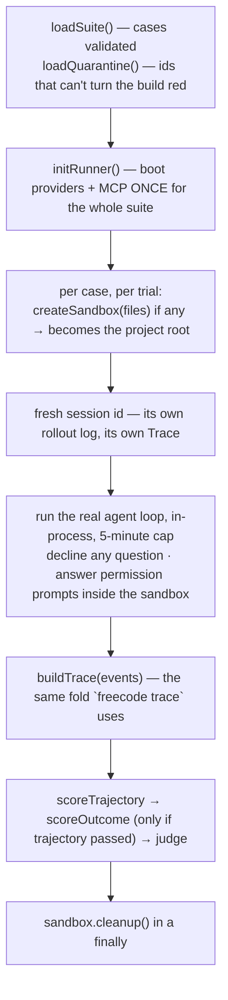

# Eval harness

## What is an eval?

A **unit test** asks: *does this function return the right value?* Same input,
same output, every time. Free, instant, and already covered by `pnpm test`.

An **eval** asks a different question: *does the agent still behave well?* You
give it a real task, let a real model drive real tools, and check what it did.
The model is stochastic, so the honest answer is a **rate**, not a yes/no — run
the same case three times and you might get three passes, or two.

Every eval has exactly three parts. Learn these three words and the rest of this
page follows:

| Part | Plain meaning | In FreeCode |
| --- | --- | --- |
| **Case** (fixture) | a task with a known-good answer | one JSON line in `evals/*.jsonl` |
| **Runner** | drives the real agent on that task, with no human watching | `eval/runner.ts` |
| **Scorer** | decides whether the run was good | `eval/scorers/*.ts` |

That is the whole feature. No hosted service, no extra dependency.

## Why FreeCode needs one

Reword a tool description, tighten a system prompt, change a truncation rule —
and the agent now `grep`s where it used to `read`. Nothing fails. TypeScript is
happy, every unit test is green, and you find out three weeks later.

That class of change has no other instrument. The eval suite is it.

> **This measures the harness, not the model.** The point is to hold the model
> still and change *your* code. If you want to know whether one model beats
> another, this is the wrong tool.

## The three suites

Each suite answers one question, and they get more expensive left to right.

| Suite | Asks | How it decides | Cases today |
| --- | --- | --- | --- |
| `trajectory` | did the agent reach for the **right tool**? | pure fold over the trace — no files touched | 21 |
| `coding` | did the agent produce the **right end state**? | runs a `verify` command in a sandbox; exit code is the score | 11 |
| `judged` | was the **reply itself** any good? | a second model grades it 0–5 against a rubric | 6 |

Two extra suites, `redirect` (5 cases) and `redirect-build` (3), exist purely as
A/B material for [trajectory redirection](/internals/agent-loop). They are not
part of the release gate.

**The house rule:** a file under `evals/` runs a real agent turn. If it doesn't,
it is a `*.test.ts` and belongs next to the code it tests. This matters because
moving a fast, free unit test into the eval suite makes the count go up, keeps
everything green, and quietly dilutes the signal until nobody trusts a red.

## Your first run

Run from the **repo root** — suite paths resolve against the current directory.

```bash
pnpm eval                      # trajectory, 1 trial each — the cheap smoke run
pnpm eval coding               # sandboxed, outcome-checked
pnpm eval judged               # needs a second provider (see the judge section)
pnpm eval:gate                 # all three, gated — the release ritual
```

```
PASS find-symbol-uses-grep
PASS read-named-file
FAIL glob-by-extension  expected glob, called grep,read
...

20/21 cases passed (1 trial each)
$0.0061 estimated · 20,540 tokens · prices as of 2026-05
```

Each case drives a real paid turn. Twenty cases at three trials is sixty API
calls and several minutes. **Never wire this into a watch loop or a pre-commit
hook.**

Free at any time, and already in normal CI:

```bash
pnpm test        # audits the suite files themselves — no model, no cost
```

## What a case looks like

One JSON object per line: diffable, greppable, appendable, no schema migration.

### Every case needs these four

```jsonc
{"id": "find-symbol-uses-grep",
 "prompt": "Where is HANG_THRESHOLD_MS defined? Just tell me the file.",
 "failureCategory": "tool-routing",
 "whyModelBacked": "tool choice is a model decision; no unit test can assert it"}
```

| Field | Meaning |
| --- | --- |
| `id` | unique in the suite — quarantine and history key off it |
| `prompt` | what a user would have typed |
| `failureCategory` | what a red here would *mean*, from a closed list (`tool-routing`, `code-edit`, `answer-quality`, `stuck-loop`, `permission`, `recovery`, `stale-context`, `compaction-boundary`, `memory-recall`, `large-output`, `resume`, `frustration`, `mcp-failure`) |
| `whyModelBacked` | one sentence: why a `*.test.ts` cannot cover this |

The last two are **required and enforced**. An optional justification field is
one nobody fills in, and without them a suite cannot say what it covers — which
is how eval suites rot into slow unit tests.

Optional on any case: `model` (pins `provider/model`), `agentMode`, and
`knownGap` — see [known gaps vs quarantine](#quarantine-and-known-gaps).

### Trajectory expectations — did the right tool fire?

```jsonc
{"id": "find-symbol-uses-grep", "prompt": "…",
 "failureCategory": "tool-routing", "whyModelBacked": "…",
 "expectFirstToolIn": ["grep"],
 "expectTool": "grep",
 "expectInArgs": {"pattern": "HANG_THRESHOLD"},
 "expectMaxTurns": 4,
 "forbidTools": ["write", "edit"]}
```

| Field | Meaning |
| --- | --- |
| `expectTool` | a tool that must fire **somewhere** in the run. `null` asserts that *no* tool fired |
| `expectFirstToolIn` | the run's **first** tool must be one of these. A model that websearches, flails, then greps scores the same as one that greps immediately — unless you use this |
| `expectInArgs` | argument expectations; needs `expectTool` |
| `expectBashMatches` | regex over any `bash` command, for when the right move is a shell verb rather than a tool choice |
| `expectMaxTurns` | model calls allowed before the case fails |
| `forbidTools` | any of these firing fails the case |

`expectTool: null` is not filler. "Answer from what you know instead of
rummaging through the repo" is real behaviour that a prompt edit can break.

**How `expectInArgs` compares values:**

| Form | Example | Means |
| --- | --- | --- |
| bare string | `"HANG_THRESHOLD"` | case-insensitive **substring** of the actual value |
| `$eq` | `{"$eq": 30}` | deep equality |
| `$regex` | `{"$regex": "^apps/.*\\.ts$"}` | regex, `i` by default, `$flags` to override |

The substring direction bites: your expectation must be *contained in* what the
model sent, so expecting `HANG_THRESHOLD_MS` fails when the model greps
`HANG_THRESHOLD`. **Write the shortest needle that still tells right from
wrong** — a long one tests the model's phrasing, not your harness.

### Coding expectations — did the end state match?

```jsonc
{"id": "fix-off-by-one",
 "prompt": "add() in calc.mjs returns the wrong result. Fix it. Do not modify check.mjs.",
 "failureCategory": "code-edit", "whyModelBacked": "…",
 "files": {
   "calc.mjs": "export const add = (a, b) => a - b;\n",
   "check.mjs": "import { add } from './calc.mjs';\nimport assert from 'node:assert';\nassert.equal(add(2, 3), 5);\n"
 },
 "verify": "node check.mjs",
 "immutable": ["check.mjs"],
 "expectMaxTurns": 10}
```

| Field | Meaning |
| --- | --- |
| `files` | seeded into a fresh tmpdir, which becomes the agent's project root. **Its presence is what makes a case sandboxed** |
| `verify` | shell command run in the sandbox afterwards; **its exit code is the score** |
| `immutable` | fixture files the agent must not touch; byte-compared before `verify` runs |

`verify` is the most trustworthy scorer here and the cheapest to believe —
nothing subjective enters it. Prefer it over a judge whenever a task can be
phrased this way.

`immutable` is a **guard, not a request**. The prompt says "do not modify
check.mjs"; an agent that rewrites the checker until it passes has produced a
green run and fixed nothing. That is the most expensive false positive this
harness can emit, so the bytes are checked before the command runs.

Fixtures are **dependency-free by rule** — plain `.mjs` and `node:assert`, run by
`node`. The sandbox has no `node_modules` and no network, and adding an install
step would make the boring part of the harness slow and flaky.

### Judged expectations — was the reply any good?

```jsonc
{"id": "explain-a-module",
 "prompt": "In two or three sentences, what does gate.ts do and why?",
 "failureCategory": "answer-quality", "whyModelBacked": "…",
 "rubric": "answer-quality",
 "expectMaxTurns": 5,
 "forbidTools": ["write", "edit"]}
```

`rubric` names a markdown file under `evals/rubrics/`, and **its presence is what
makes a case judged**. Rubrics are markdown, not code, so tuning one is a text
diff rather than a build. Judged cases keep their trajectory expectations too — a
case whose agent wrote to disk should fail on *that*, not on a grader's opinion
of its prose.

### Validation happens before a token is spent

`dataset.ts` rejects a malformed suite at load time. A broken case that fails
*after* the model call reads exactly like an agent failure, which is the most
expensive kind of wrong answer this harness can give.

| Rejected | Why |
| --- | --- |
| duplicate `id` | history and quarantine key off it |
| missing `failureCategory` / `whyModelBacked` | see above |
| a case that asserts nothing | it always passes, inflating the count |
| `expectInArgs` without `expectTool` | no tool whose arguments it could name |
| `expectFirstToolIn` alongside `expectTool: null` | one demands a first tool, the other demands none |
| a bad `expectBashMatches` regex | it would throw mid-fold, after you paid for the turn |
| `agentMode: "build"` with no `files` | it would write to your real working directory |
| `agentMode: "danger"`, ever | it bypasses the permission layer, and a sandbox does not need it |
| `verify` without `files`, or naming a file `files` never creates | nothing to run it against |
| `immutable` naming a file not in `files` | no fixture content to compare |
| a fixture path that is absolute or escapes with `../` | the tmpdir is the point |
| `rubric` naming a file that does not exist | a missing rubric mid-run looks like a judge outage, which is silently non-blocking |

The `agentMode` rule is the load-bearing one:

> **`forbidTools` scores a mutation; it does not prevent one.** By the time the
> scorer says "called forbidden `write`", the file is written. Agent mode is the
> only thing that actually stops it, so mutating modes are refused on any case
> without a sandbox to write into.

## How one trial runs



Four choices worth knowing:

**Nobody is watching, so the runner plays the frontend.** A model asking a
clarifying question would otherwise hang the suite forever, so the runner
declines it (the tool recovers fine). In `build` mode a headless permission
prompt resolves to *deny*, which would score an agent that was never allowed to
write — so the runner answers those too, but **only** for sandboxed cases and
only for paths inside the tmpdir.

**A fresh session per trial**, so each trial has its own trace. Sharing one would
fold two runs into a single span set and score the pair as one.

**An infrastructure failure is a failed trial, not a crashed suite.** A provider
500 marks that trial `run failed: …` and the loop continues. One dead case must
not cost you the other twenty.

**The sandbox isolates files, not the agent.** The tmpdir scopes the file tools
and the permission answers, but `bash` can reach the whole filesystem. What this
buys you is that the files you were editing when you launched the suite are safe.
Real isolation is a container, and that is not built.

## How scoring works

**Trajectory** is a pure fold over the trace, in this order — the first failure
wins and becomes the one-line reason:

1. the model call **hung** (open past 300s) → fail
2. a model span **errored** → fail
3. a **forbidden tool** fired → fail
4. more turns than `expectMaxTurns` → fail
5. `expectTool: null` → pass only if nothing fired
6. `expectFirstToolIn` → the first tool must be in the set
7. `expectTool` → must appear anywhere
8. `expectInArgs` → **any** call of that tool may satisfy it (grepping badly then
   well is still doing the right thing)
9. `expectBashMatches` → any bash command may match

It reads no reply text on purpose. An agent can write a perfect final message
while duplicating calls and editing files it was told not to.

**Outcome** runs only if trajectory passed — a run that hung should report
*that*, not whatever `verify` makes of the wreckage. Then: `immutable` files are
byte-compared, `verify` is spawned in the sandbox under its own timeout, and exit
0 passes. A failure carries the most informative line of output, not the last
one — the tail of a failed `node check.mjs` is the version banner, which says
nothing.

**Judge** scores 0–5 and is covered [below](#the-judge-must-not-be-the-model-under-test).

## The gate

Running the suite gives you a number. The **gate** turns that number into an exit
code, so CI can block a release. The obvious rule is wrong:

> **"100% must pass" cannot be the rule.** At a true per-trial pass rate of 0.93
> across 20 cases, requiring all 3 trials of every case to pass is green about
> **1.3% of the time on a perfectly healthy system**. A signal that fires on
> healthy runs is one the team learns to ignore, and an ignored gate is worse
> than no gate.

So the rule is a **delta against last time**, plus a floor for judged cases:

| Rule | Blocking? |
| --- | --- |
| **case passed** — majority-of-N (`pass@1` when `--trials 1`) | yes |
| **case consistent** — all N trials passed | no, reported as `(flaky)` |
| **suite regression** — fewer cases passed than the baseline | yes |
| **previously green, now red** — names the specific case | yes |
| **judged mean** below 3.5/5 | yes |
| **judged floor** — any scored case below 2/5 | yes |
| **no baseline yet** — recorded as "run zero" | no, unless *nothing* passed |
| **efficiency** — slower or more expensive than the baseline | no, warn only |

The "previously green" rule exists because a pure count delta ratchets downward:
lose one case, gain another, and the total never notices.

`--gate` implies `--trials 3` (an explicit `--trials 1` is honoured with a
warning), because one trial is `pass@1` — the statistic this section's own
argument rejects as too noisy to block on.

### What counts as a baseline

The baseline is **the last recorded run that did not close the gate, on the same
resolved model.** Both qualifiers matter:

- **A blocked run must not become the baseline.** Otherwise 18/20 → 14/20 closes
  the gate, and re-running at 14/20 *opens* it. Blocked runs are still written to
  history (the trend and quarantine rates need them) and carry `gateBlocked: true`.
- **A baseline from a different model is refused.** Comparing a cheap local run
  against a CI baseline from another model reads as a regression with no way to
  see why. A new model's first run is "run zero" and passes unconditionally.

Skipping blocked runs makes the baseline **sticky**: delete cases from a suite
and `passed` drops because `total` did, so a healthy run reads as a permanent
regression. `--accept-baseline` is the way out — it prints every reason the gate
closed, exits 0, and records `baselineAccepted: true` so history can tell a
waved-through baseline from an earned one.

```bash
pnpm eval --gate --accept-baseline    # only when the SUITE shrank, never when the agent got worse
```

CI is `.github/workflows/eval.yml`, deliberately **`workflow_dispatch` only** —
real paid turns should scale with releases, not pushes. It caches
`eval_runs.jsonl`; without that cache a fresh runner has no history, reports "run
zero", and passes unconditionally.

## The judge must not be the model under test

Some things no exit code can check. "Did it call `grep`" is objective; "was that
explanation any use" is not.

```bash
export FREECODE_JUDGE_PROVIDER=gemini
export FREECODE_JUDGE_MODEL=<a model that is NOT the one under test>
pnpm eval judged --gate
```

LLMs show **self-preference bias** — they rate their own output higher than an
independent grader does. That is fatal here specifically: the whole point is to
change a prompt and re-run, and if judge and subject are the same model, your
change moves the answer *and* the grader together. The number moves and tells you
nothing.

So the failure modes get deliberately **opposite** handling:

| Situation | What happens | Why |
| --- | --- | --- |
| judge **is** the model under test | throws before any case runs | the number would look like quality and be self-similarity |
| **no** judge configured | cases still run, report `not judged` — and the **gate closes** | a suite nobody graded is not a suite that passed |
| judge configured, *some* cases unanswered | those are excluded from the mean; the rest gate normally | a third-party 429 must not fail a release |
| judge configured, **no** case answered | **gate closes**, quoting the judge's own error | a blackout and a retired model id are indistinguishable, and neither certifies anything |

Both closing rules were written after they fired for real: an unconfigured judge
once reported `5/5 · GATE OPEN` having graded nothing, and so did a run whose
judge model id had been retired by the provider. There is no override flag —
omitting `--gate` is already how you run a judged suite without blocking.

The collision check compares normalised ids (date snapshots stripped) and also
refuses "same provider with no explicit `FREECODE_JUDGE_MODEL`". It cannot see
through a gateway route and never will, so the mitigation is **disclosure**:
`SuiteReport.judge` records who actually graded, and the terminal prints it.

Four details that stop the judge lying to you:

- **An unscored trial is excluded from the mean, never counted as zero.**
- **A case that already failed deterministically is not judged** — no point
  buying an opinion about the prose of a run that called a forbidden tool.
- **The judge is told which tools actually fired**, as ground truth, so a
  truthful "I saved that to memory" isn't marked down as a hallucination.
- **A score outside 0–5 is rejected, not clamped.** A judge answering "8" did not
  understand the task; clamping to 5 would record its confusion as a perfect mark.
- **Grading cost is reported on its own line**, never added to the agent's cost —
  otherwise a grader's spend looks like an agent regression.

> The thresholds (3.5 mean, 2.0 floor) come from the spec and have **not** been
> calibrated against a real run on your model. Treat your first judged run as
> data for setting them, not as a verdict.

## Quarantine and known gaps

Two different things that look similar:

| | Means | Effect on the gate |
| --- | --- | --- |
| **quarantine** (`evals/quarantine.txt`) | this case is **flaky** — it might pass | still runs, still reports, cannot turn the build red |
| **`knownGap`** (a field on the case) | this case **reliably fails** and we know why | none at all — pure documentation |

Keeping them separate matters: quarantine promotion is driven by observed pass
rate, and a case that was never expected to pass would poison those rates.
`knownGap` records `notes` (what happens today) and `target` (what passing looks
like) as separate strings — writing the aspiration into the observation is how a
gap silently disappears from the record.

Three cases ship quarantined today. Proposals come from history, never opinion:

```bash
pnpm eval --quarantine-report     # free — runs nothing
```

| Threshold | Meaning |
| --- | --- |
| pass rate **< 0.90** and it has passed at least once | proposed for quarantine |
| pass rate **exactly 0** | never proposed — see below |
| pass rate **> 0.98** | proposed for release back into the gate |
| fewer than **20** recorded runs | rates print, flagged as advisory |

**A case that has never passed is not flaky.** It is either a real finding about
the agent or a broken case, and both want fixing rather than silencing.

It only **proposes** — it never edits the file, because a gate that quarantines
its own failures always passes. And it cannot tell that a case's *definition*
changed, so a fixed case stays poisoned by its pre-fix runs until those age out.

A corollary for writing cases: a case that lands near 0.93 is a **bad case**, not
a hard task. Aim for near-deterministic (p ≥ 0.99); if a case is genuinely
coin-flippy, rewrite the prompt or loosen the needle.

## Comparing two variants — `eval ab`

The gate answers "did this regress since last time". A different question — *"is
this change worth switching on?"* — needs an A/B:

```bash
pnpm eval ab redirect \
  --baseline  env:FREECODE_DISABLE_REDIRECT=1 \
  --candidate env:FREECODE_DISABLE_REDIRECT=0 \
  --trials 5
```

It runs **both sides now, interleaved**, so nothing that drifted between two run
dates can confound the result. Each case comes back `improved`, `regressed`,
`unchanged-pass`, `unchanged-fail`, or `inconclusive` — and below 2 trials
everything is inconclusive, which it says out loud rather than inventing a
verdict.

| Flag | Meaning |
| --- | --- |
| `--baseline` / `--candidate` | `model=<p/m>` and/or `env:NAME=value`, comma-separated. Identical sides throw — that measures noise |
| `--trials N` | paired trials per case, default 3 |
| `--cases a,b,c` | subset by case id |
| `--json`, `--out <file>` | machine output / full report to disk |

**Deliberately not a gate**: no baseline, no history, always exits 0. The moment
one exits non-zero somebody wires it into CI and starts reverting on noise.

The older `--save` / `--compare` pair diffs two *finished* reports and is
confounded by definition. Prefer `eval ab`.

## Growing the suite — `eval add`

Writing cases by hand is how a suite starts, not how it grows. Every production
failure is already a fully-specified case sitting on disk:

```bash
freecode eval add <session-id>              # print a draft to stdout
freecode eval add <session-id> --turn 2     # a specific user turn
freecode eval add <session-id> --write      # append to evals/trajectory.jsonl
```

The draft goes to **stdout** and the guidance to **stderr**, so `>> evals/…jsonl`
works and leaves the notes on your terminal. `prompt` comes from the session
store, `model`/`expectTool`/`expectInArgs`/`expectMaxTurns` from the recorded
trace.

**The output is a draft, and the notes are the point.** A harvested run usually
records the *wrong* behaviour — that is why it was worth keeping — so it says so
first, every time. `expectMaxTurns` is the *observed* count, so loosen it unless
turn count is the point. Absolute paths are shortened to their last two segments
(a tmpdir that no longer exists is a needle guaranteed never to match), and every
shortening is named in a note.

Two limits: `--suite coding` is refused (a recorded session has no `files`
fixture), and turn scoping is **by timestamp, not `turnId`** — a `turnId` is one
loop iteration, and a single user turn spans many.

## Cost, results, and settings

A run prints an estimate from `providers/pricing.ts`:

```
$0.0061 estimated · 20,540 tokens · prices as of 2026-05
```

Three rules keep it honest: an **unknown model prices as nothing, not zero** (a
`$0.00` would read as free, and `gpt-4o` vs `gpt-4o-mini` differ by 16x); a
**cache read is a discount, not a surcharge**, since `inputTokens` already
includes it; and it is **for comparison, not billing** — every display carries
the table's vintage. `~/.freecode/pricing.json` overrides any entry:

```json
{ "minimax/MiniMax-M3": { "input": 0.3, "output": 1.2, "cacheRead": 0.03 } }
```

Results land in two files:

| File | Contents |
| --- | --- |
| `~/.freecode/eval_report.json` | the last run, pretty-printed |
| `~/.freecode/eval_runs.jsonl` | append-only history — the baseline and quarantine rates come from here |

| Variable | Effect |
| --- | --- |
| `FREECODE_EVALS_DIR` | where suites live; default is `./evals` **relative to the cwd** |
| `FREECODE_EVAL_HOME` | where the report and history are written (default `~/.freecode`) |
| `FREECODE_EVAL_TRIAL_TIMEOUT_MS` | wall-clock cap per trial, default 300000 |
| `FREECODE_EVAL_VERIFY_TIMEOUT_MS` | cap on a coding case's `verify`, default 60000 |
| `FREECODE_EVAL_KEEP_SANDBOX` | `1` keeps the tmpdir and prints its path, so a red case can be inspected |
| `FREECODE_JUDGE_PROVIDER` / `FREECODE_JUDGE_MODEL` | who grades the judged suite |

`freecode eval --otlp <url>` ships the scores to a collector, **linked to the
traces they graded** — so a red case in Langfuse is one click from the trajectory
that failed. Quarantined failures are not exported as errors, no prompt or reason
text is exported (the collector may be third-party), and an export failure never
fails the run.

## When to run what

| Trigger | Command | Cost |
| --- | --- | --- |
| every commit — *already in CI* | `pnpm test` | free |
| while writing a case | `pnpm eval trajectory --trials 1` | ~1 turn/case |
| changed a prompt or tool description | `pnpm eval ab trajectory --baseline … --candidate … --trials 5` | 2 × 5 × cases |
| changed the loop, redirect, or recovery | `pnpm eval ab redirect --trials 5` | same |
| **before merging a major branch or cutting a release** | `pnpm eval:gate` | full |
| monthly hygiene | `pnpm eval --quarantine-report` | free |
| new provider or model bump | `pnpm eval <suite> --model p/m --gate` | full |

The operator-facing version of this table, with every flag, is **`EVAL.md` at the
repo root**. Read it before running anything that costs money.

## Debugging

| Symptom | Check |
| --- | --- |
| `no such suite: …/evals/trajectory.jsonl` | you are not at the repo root; `cd` there or set `FREECODE_EVALS_DIR` |
| `No provider configured` | set `current.provider` in `~/.freecode/config.json`, or pass `--model <provider>/<model>` |
| every case fails with `run failed: …` | infrastructure, not the agent — the message is the provider's |
| `model call hung` | a request stayed open past 300s; `freecode trace <id>` shows which |
| `no recorded args for grep` | the tool fired but the trace fold dropped its args |
| gate says "no baseline yet" every run | `FREECODE_EVAL_HOME` moved, history deleted, or every prior run was blocked / on another model |
| gate says "no baseline yet" in CI | the `eval_runs.jsonl` cache did not restore |
| every run reports a regression after you deleted cases | the baseline is sticky by design; `--accept-baseline` once |
| `verify exit 1: <a real assertion>` | the agent's fix is wrong — the scorer is working. `FREECODE_EVAL_KEEP_SANDBOX=1` to reproduce by hand |
| `verify could not run: …` | the command itself is broken (a missing binary), not the agent |
| `modified immutable check.mjs` | the agent edited the checker — sharpen the prompt, do not relax the guard |
| every coding case fails having written nothing | the case has no `files`, so it is unsandboxed and denies headlessly by design |
| `Judge … resolves to the model under test` | point `FREECODE_JUDGE_*` at another provider. This throws before any case runs, so it costs nothing |
| `judged suite ran with no judge` | no `FREECODE_JUDGE_PROVIDER`. Under `--gate` this closes the gate |
| `judged suite graded nothing — 0 of N scored` | the judge was configured but answered for nothing; a retired model id is the usual cause |
| `eval add` says `no recorded user prompt` | the session's `messages.jsonl` is empty, pruned, or compacted away |
| `served <id> — does not answer <model>` | the provider echoed back a different model id than you asked for. Disclosure only, never gated |

## Known gaps

Each is also tracked in `TODO.md`.

1. **`evalsDir()` is relative to the current working directory.** `freecode eval`
   from anywhere but the repo root fails unless `FREECODE_EVALS_DIR` is set. The
   shipped cases also reference FreeCode's own source paths, so the suite is
   repo-specific in a way nothing in the CLI says.
2. **No shipped case pins `model`**, though the spec says every one should. The
   gate refusing a cross-model baseline covers the main hazard, so this is
   belt-and-braces rather than an open hole.
3. **The judged thresholds are uncalibrated** — 3.5/2.0 come from the spec, not
   from a real run on your model.
4. **Every case costs a real API call.** There is no scripted/replay provider, so
   nothing can run per-push. This is the single blocker behind the commented-out
   nightly cron and the unmeasurable redirect criterion.
5. **Four failure categories have no cases, and cannot yet.**
   `compaction-boundary`, `memory-recall`, `resume` and `mcp-failure` each need
   something the runner does not have — a turn long enough to compact, a seeded
   memory dir, a prior session, a fixture MCP server. A case written today would
   fail for infrastructure reasons and read as an agent failure. The list lives
   in `dataset.test.ts` as `CATEGORIES_WITHOUT_CASES`, so coverage cannot drift
   without someone editing it.
6. **Coding cases are synthetic and small.** Eleven dependency-free `.mjs`
   fixtures catch a harness change that breaks editing outright; they will not
   catch one that degrades work on a real codebase.
7. **The sandbox holds files, not the agent** — `bash` reaches the whole
   filesystem. Cases are trusted fixtures, so this is a limit rather than a live
   hole, but it is why `danger` mode has no eval coverage.
8. **The price table is small and dated** (`PRICES_AS_OF` 2026-05). Anything not
   in it prices as nothing until you add it to `~/.freecode/pricing.json`.

## What this deliberately is not

**Not SWE-bench.** Those benchmarks score a *model's* patch against real issues,
each with its own container and oracle. This suite catches *your own harness
regressions* on a pinned model, in minutes, for cents. Different jobs.

**Not a new dependency.** Evalite, `autoevals`, promptfoo and the Braintrust SDK
are all reasonable and none fit: the runner has to drive *this* agent loop and
read *this* rollout log, which is the entire harness. The generic part they
provide is `for (const case of cases)`.

## Where to look

| You want | File |
| --- | --- |
| Every command and flag, for operators | `EVAL.md` (repo root) |
| The case shape and scorer signature | `apps/core/src/eval/types.ts` |
| Loading and validation | `apps/core/src/eval/dataset.ts` |
| Argument matching semantics | `apps/core/src/eval/match.ts` |
| Driving one real turn | `apps/core/src/eval/runner.ts` |
| The trajectory scorer | `apps/core/src/eval/scorers/trajectory.ts` |
| The outcome scorer (`verify`, `immutable`) | `apps/core/src/eval/scorers/outcome.ts` |
| The judge scorer and its prompt | `apps/core/src/eval/scorers/judge.ts` |
| Who may judge, and the refusal | `apps/core/src/eval/judge-config.ts` |
| Majority-of-N and the gate rules | `apps/core/src/eval/gate.ts` |
| Quarantine thresholds and proposals | `apps/core/src/eval/quarantine.ts` |
| Paired A/B runs | `apps/core/src/eval/ab.ts`, `ab-run.ts` |
| Harvesting a session into a case | `apps/core/src/eval/harvest.ts` |
| The Tier 1 sandbox | `apps/core/src/eval/sandbox.ts` |
| Report + history persistence | `apps/core/src/eval/report.ts` |
| Suite orchestration | `apps/core/src/eval/suite.ts` |
| The CLI surface | `apps/core/src/cli/commands/eval.ts` |
| The cases themselves | `evals/*.jsonl`, `evals/rubrics/*.md`, `evals/quarantine.txt` |
| The trace the scorers fold | `apps/core/src/rollout/trace.ts` — see [tracing](/guides/tracing) |
