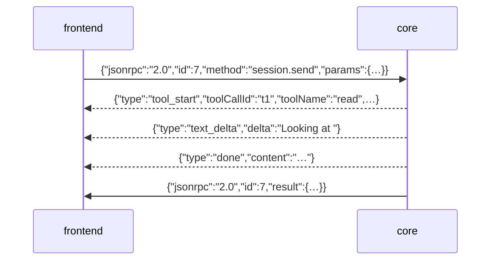
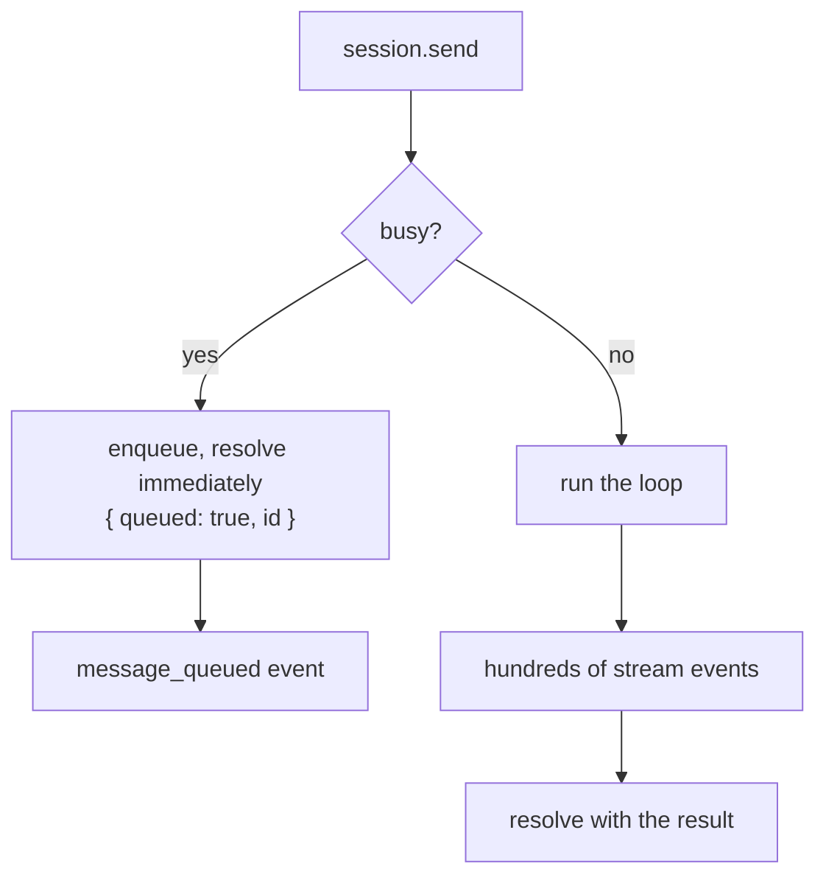
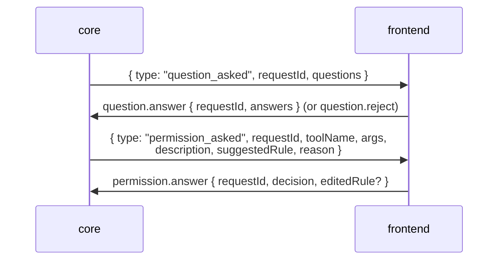

# IPC protocol

FreeCode's frontends — [TUI](/interfaces/tui), [VS Code](/interfaces/vscode),
[web](/interfaces/web), [desktop](/interfaces/desktop) — contain no intelligence.
They render, and they talk to `apps/core` over **JSON-RPC 2.0 on stdin/stdout**.
Everything else (the agent loop, tools, providers, memory, permissions) happens on
the other side of that pipe.

That boundary is the reason a feature lands in every frontend at once: implement
it in core, and the TUI, the extension, and the browser all get it as soon as they
render the events. It is also the reason the protocol has to be simple — four
clients implement it, and one of them is a browser that never sees a pipe at all.

## The wire

Newline-delimited JSON. One JSON value per line, in both directions.



**Two kinds of line share the pipe**, and telling them apart is the first thing
any client does:

| Line | Shape | Correlates by | Volume |
| --- | --- | --- | --- |
| Response | `{ jsonrpc, id, result \| error }` | `id`, matched to a pending request | one per request |
| Stream event | `{ type, … }` | `sessionId` (stamped by the bridge) | thousands per turn |

The discriminator is literally `parsed.type && !parsed.jsonrpc`
(`apps/tui/src/ipc/client.ts:138`). Stream events are **not** JSON-RPC
notifications — they carry no `jsonrpc` or `method` field. That is a deliberate
simplification (the payload is the event, with no envelope to unwrap) but it is a
private convention, not the spec; see [gaps](#known-gaps).

Why two kinds at all? Because JSON-RPC has no notion of a partial answer. A
`session.send` may run for ten minutes and produce a thousand intermediate facts;
one response can't express that. So the request resolves once, at the end, and
everything that happened along the way arrives out of band.

## Requests

`handleRequest()` (`server.ts:1031`) is the whole dispatcher: look up the method,
call it, wrap the result. Errors map to codes:

| Code | Meaning |
| --- | --- |
| `-32601` | method not found |
| `-32603` | handler threw — the message is the error's text |
| `-32700` | malformed JSON (web transport) |
| `-32002` | `REQUEST_ALREADY_RESOLVED` — a prompt was answered by someone else first |
| `-32001` | unauthorized (web transport) |

`-32002` is the interesting one. When two frontends watch the same session and
both answer a permission prompt, the loser isn't wrong — it just lost a race.
A generic `-32603` would render as a scary failure; a distinct code lets the UI
show *"already answered"* as state rather than as an error (`server.ts:105`).

The stdin reader buffers until it sees `\n`, so a request split across chunks
still parses (`server.ts:1157`), and a trailing line at `end` is dispatched too.
A parse failure writes to **stderr** and drops the line — it never emits a
protocol-level error response, because a line that didn't parse has no `id` to
answer.

## Methods

Handlers live in one map in `server.ts`, currently 49 methods:

| Group | Methods |
| --- | --- |
| Tools | `tools.list`, `tools.call` |
| Session lifecycle | `start`, `send`, `stop`, `compact`, `dequeue`, `list`, `resume`, `switch`, `fork`, `archive`, `delete`, `getInterrupted` |
| Session transfer | `export`, `import`, `upload`, `download` |
| Claude Code import | `session.claudeList`, `session.claudeTranscript` |
| Providers & models | `providers.list`, `models.list`, `models.contextLimit` |
| Config | `config.get`, `getCurrentModel`, `setCurrentModel`, `setApiKey`, `getLastAgentMode`, `setLastAgentMode` |
| Memory | `memory.list`, `get`, `save`, `delete`, `query`, `buildPrompt`, `graph.stats`, `graph.rebuild`, `graph.explore` |
| Prompts | `question.answer`, `question.reject`, `permission.answer`, `permission.reject` |
| Misc | `commands.list`, `commands.resolve`, `skills.list`, `mcp.status`, `history.list`, `history.append`, `usage.get` |

Signatures are declared in `packages/shared/src/ipc/protocol.ts` as a `METHODS`
const object, which exists to be *read by the type system*:

```ts
export type MethodName   = keyof typeof METHODS;
export type MethodParams<M extends MethodName> = (typeof METHODS)[M]["params"];
export type MethodResult<M extends MethodName> = (typeof METHODS)[M]["result"];
```

A client's `call()` is then generic over `MethodName`, so a typo in a method name
or a missing param is a compile error in the frontend rather than a `-32601` at
runtime. Note the caveat in [gaps](#known-gaps): only 24 of the 49 methods are
actually declared there.

## `session.send`, the long call

Most methods return in milliseconds. This one runs a whole agent turn.



Three behaviours worth knowing:

- **A second send while a turn is running is queued, not raced.** Two loops on one
  `sessionId` used to corrupt the message history, so the prompt is parked in a
  FIFO and the loop's `finally` drains it (`server.ts:402`). The call resolves
  *immediately* with `{ queued: true, id }`, and `message_queued` carries the same
  data on the stream so SSE subscribers stay in sync.
- **Images are refused while busy** rather than dropped — silently discarding an
  attachment is data loss.
- **Provider and model resolve by one precedence**: explicit call override →
  `config.json` → the session's pin. They used to disagree (provider preferred
  config, model preferred the session), which could produce mismatched pairs like
  provider `openai` with model `MiniMax-M3` (`server.ts:418`).

## Stream events

One union, `StreamEvent` (`protocol.ts:84`), grouped by what a frontend does
with it:

| Group | Events |
| --- | --- |
| Content | `text_delta`, `thinking_delta`, `text`, `thinking`, `done`, `error` |
| Tools | `tool_start`, `tool_output`, `tool_complete` |
| Prompts (need a reply) | `question_asked`, `permission_asked` |
| Queue | `message_queued`, `message_dequeued` |
| Context | `compaction_start`, `compaction_complete`, `cache_status`, `usage_totals` |
| Memory | `memory_saved`, `memory_injected` |
| Advisory | `notice` |

The `_delta` / full-value pairs exist because not every provider path streams:
deltas arrive during streaming, and the full `text` is emitted at turn end as a
snapshot. A frontend can render either and stay correct.

Events reach the wire through one subscription — the **speaker wire**
(`server.ts:1114`): everything published on the internal bus is mapped by
`busEventToClientEvent()` and written to stdout *and* the web SSE channel.

The bridge (`bus/bridge.ts`) does three jobs, and the first is the one that
matters:

1. **Drops internal-only events.** `tools.changed`, `mcp.tools.changed`,
   `tool.called`, `tool.completed` never reach a frontend — the last two are
   redundant with the loop's authoritative `tool_start`/`tool_complete`, and
   emitting both would double-render every tool call.
2. **Stamps `sessionId`** from the relay wrapper, so a consumer multiplexing
   several sessions can route each line. Event authors don't have to remember.
3. Forwards everything else verbatim.

Because the speaker wire is subscribed at startup and independent of any request,
**out-of-band notices still arrive when no call is in flight**. That is what makes
`memory_saved` work: turn-end extraction is fire-and-forget and finishes *after*
the turn's `done`, when the stream would otherwise be closed.

## Prompts are round trips

Two events invert the direction — core asks, the frontend answers:



The permission payload carries everything the UI needs to render a decision
without asking core anything else: a human-readable `description`, the
`suggestedRule` to offer as "always allow", and the `reason` explaining which rule
or mode default triggered the ask. Decisions are
`allow-once | allow-session | allow-project | allow-always | deny`, and the
frontend can hand back an `editedRule` if the user narrowed the suggestion.

## What a client owns

Core is deliberately dumb about its clients; the client owns the hard parts.
Reading `apps/tui/src/ipc/client.ts` is the fastest way to see the full contract:

- **Framing.** Buffer stdout, split on `\n`, keep the partial tail.
- **Correlation.** A map of pending requests keyed by id; a monotonic counter
  issues them.
- **Timeouts, two kinds.** 30s for a normal call; `session.send` instead gets a
  **600s idle** deadline that every stream event resets (`client.ts:65`). A total
  timeout would kill any turn longer than it; an idle one fires only when core has
  gone genuinely silent. Bash alone can legitimately be quiet for minutes.
- **Supervision.** If core dies, in-flight calls reject honestly and the client
  respawns it with backoff `[250ms, 1s, 3s]`. A backend that ran healthily for a
  minute before dying gets a fresh budget, so three unrelated crashes across a day
  don't exhaust the retries permanently.
- **Re-resume after a restart.** Core keeps its session map in memory, so a
  respawned process knows nothing about the session the UI is still showing. The
  restart handler exists to re-`session.resume` before the next turn
  (`client.ts:92`).

## The web transport

The browser can't read a pipe, so `web-server.ts` puts the *same* `handleRequest`
behind HTTP:

| | Pipe | HTTP |
| --- | --- | --- |
| Requests | stdin lines | `POST /api` with the JSON-RPC body |
| Events | stdout lines | `GET /events?sessionId=…` (SSE) |
| Auth | process boundary | bearer token, constant-time compare |

The protocol is identical — same methods, same codes — which is the point of
routing both through one function.

SSE adds what a pipe gets for free. Each event is assigned a monotonic `seq`
emitted as SSE's native `id:` field, so a reconnecting client sends
`Last-Event-ID` and gets replayed from there (`stream-subscribers.ts:114`); if the
buffer no longer covers the gap, it receives an explicit `stream_gap` event rather
than silently missing turns. A heartbeat comment frame every 15s keeps
intermediaries from closing an idle connection.

Auth gates `/api` and `/events` but deliberately **not** the static SPA — gating
the page would block the very page that carries the token to the API.

## Known gaps

1. **`METHODS` covers 24 of 49 methods.** Everything under `memory.*`,
   `config.*`, `models.*`, and half of `session.*` (`fork`, `switch`, `archive`,
   `delete`, `export`, `import`, `upload`, `download`, `getInterrupted`) is
   implemented in `server.ts` but absent from `protocol.ts`. A frontend calling
   those gets no compile-time checking at all, which is exactly what the map
   exists to provide.
2. **`session.send`'s declared result is wrong.** `METHODS` says
   `StreamResponse | { queued: true; id: string }`, but the handler resolves with
   a `LoopResult` (`{ success, message, content, thinking, turnCount,
   iterationCount, finalState }`). Its declared params also omit `model` and
   `agentMode`, both of which the handler reads.
3. **No `-32602` anywhere.** Handlers cast `params as { … }` with no runtime
   validation, so a missing or mistyped field surfaces as `undefined` deep inside
   a handler — usually as a confusing `-32603` — instead of "invalid params" at
   the boundary. The protocol has a code for this; nothing uses it.
4. **Stream events aren't JSON-RPC notifications.** A standard notification
   (`{ jsonrpc, method, params }`, no `id`) would be self-describing; the current
   heuristic means any event needing a field called `jsonrpc` would be
   misclassified as a response, and any result object with a `type` field as an
   event.
5. **One streaming call at a time per client.** The TUI holds a single
   `activeStreamId` and a single `onStreamEvent` slot (`client.ts:46`), so
   although the bridge stamps `sessionId` for multiplexing, this client can't
   drive two concurrent sessions over one process.
6. **No batch support.** JSON-RPC batch arrays are unspecified and unhandled on
   both transports.

## Where to look

| You want | File |
| --- | --- |
| Types, `METHODS`, `StreamEvent` | `packages/shared/src/ipc/protocol.ts` |
| Every handler, dispatch, framing | `apps/core/src/server.ts` |
| Bus → wire mapping | `apps/core/src/bus/bridge.ts` |
| HTTP/SSE transport | `apps/core/src/web-server.ts` |
| SSE replay, seq, heartbeat | `apps/core/src/web/stream-subscribers.ts` |
| A complete client | `apps/tui/src/ipc/client.ts` |

Related: [Event bus](/internals/bus) for where these events originate,
[Agent loop](/internals/agent-loop) for what produces them, and
[IPC methods](/reference/ipc-methods) for the per-method reference.
